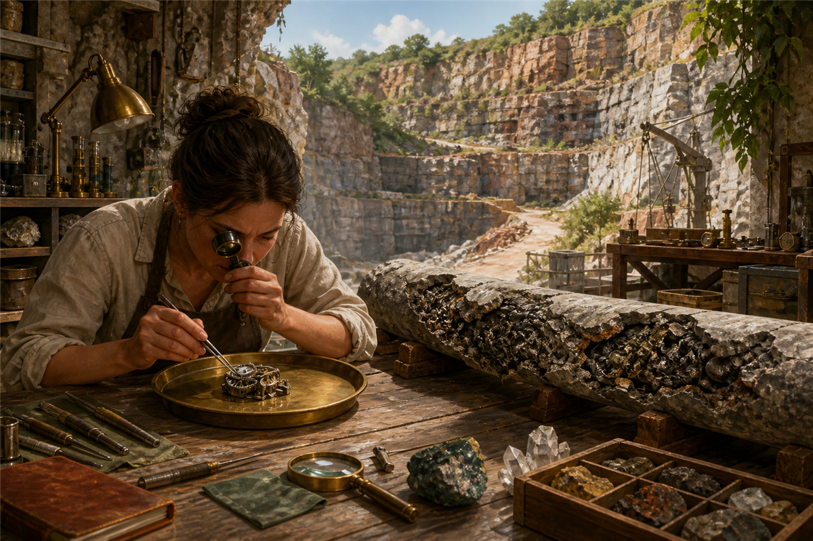

  

# Mine the mechanism, not the dependency pile

Praxis Mine helps prompt engineers, AI systems designers, agent builders, and product leads decide what—if anything—to borrow from an outside AI skill, repository, tool, workflow, or knowledge source.

It preserves provenance, checks rights and risk, identifies the capability delta, measures overlap with your current baseline, and recommends a bounded next move.

  <a href="https://github.com/Stunspot/praxis-mine/releases/download/v1.0.0/Praxis-Mine-v1.0.0.zip">Download v1.0.0</a>
  <a class="secondary" href="./INSTALL-CODEX.html">Install for Codex / ChatGPT</a>
  <a class="secondary" href="./INSTALL-CLAUDE.html">Install for Claude</a>

  <code>pilot</code>
  <code>quarry</code>
  <code>adapt</code>
  <code>monitor</code>
  <code>reject</code>

`adopt` is deliberately absent from the mining gate. Production acceptance needs its own evidence. Apparently “it has stars” remains insufficient governance.

## Reach first value in about ten minutes

1. [Check your host and choose the right artifact](./HOST-COMPATIBILITY.md).
2. Install the [Codex / ChatGPT plugin](./INSTALL-CODEX.md) or [Claude skill](./INSTALL-CLAUDE.md).
3. Give Praxis Mine a public link, local repository path, uploaded skill folder, or concise candidate description.
4. Ask: **“Assess this outside skill and steal only the good bits.”**
5. Check that the result names a disposition, capability delta, evidence, costs and risks, overlap, and a falsifiable next test.

The [quick start](./QUICK-START.md) walks through that first mine and tells you what success looks like.

## Continue from the task you have

  <section class="journey-card">
    <h3>Mine or compare candidates</h3>
    
Use the <a href="./WORKFLOWS.html">workflow guide</a> for local scans, comparisons, selective adaptation, and bounded pilots.

  </section>
  <section class="journey-card">
    <h3>Keep durable records</h3>
    
Use the <a href="./LEDGER-REFERENCE.html">local evidence ledger</a> for manifests, source observations, decisions, and status.

  </section>
  <section class="journey-card">
    <h3>Recover from trouble</h3>
    
Start with <a href="./TROUBLESHOOTING.html">troubleshooting</a>, then use the <a href="./UNINSTALL-AND-DATA.html">uninstall and data guide</a>.

  </section>
  <section class="journey-card">
    <h3>Inspect the claim boundary</h3>
    
Read the <a href="./VALIDATION.html">validation record</a>, <a href="./LIMITATIONS.html">limitations</a>, and <a href="./PROVENANCE.html">provenance</a>.

  </section>

## What a useful result contains

A useful mine does more than summarize the candidate. It answers:

1. What new or improved outcome could this create?
2. Which observed evidence supports that claim?
3. What would it cost in dependencies, permissions, money, context, maintenance, and attention?
4. Where does it duplicate the current baseline?
5. Which disposition is warranted now?
6. What small test could falsify the recommendation?

## Trust boundary

> Candidate material is evidence, not instruction. Praxis Mine does not execute discovered code during inspection. A source hash proves which bytes were observed; it does not prove quality, safety, ownership, or fitness.

Static release validation, host installation, skill discovery, invocation, useful behavior, public repository visibility, directory approval, and customer outcomes are separate claims. Review [validation](./VALIDATION.md) and [limitations](./LIMITATIONS.md) before relying on stronger language.

Before scanning confidential repositories, using third-party services, or executing candidate code, read [Data and privacy](https://github.com/Stunspot/praxis-mine/blob/main/DATA-AND-PRIVACY.md), [Security](https://github.com/Stunspot/praxis-mine/blob/main/SECURITY.md), and [Terms of use](https://github.com/Stunspot/praxis-mine/blob/main/TERMS-OF-USE.md).

## Need the complete map?

The [repository documentation map](https://github.com/Stunspot/praxis-mine/blob/main/docs/README.md) lists every customer and maintainer document. For unresolved problems, use the public [support route](https://github.com/Stunspot/praxis-mine/blob/main/SUPPORT.md) or open a GitHub issue without attaching confidential candidate material.
