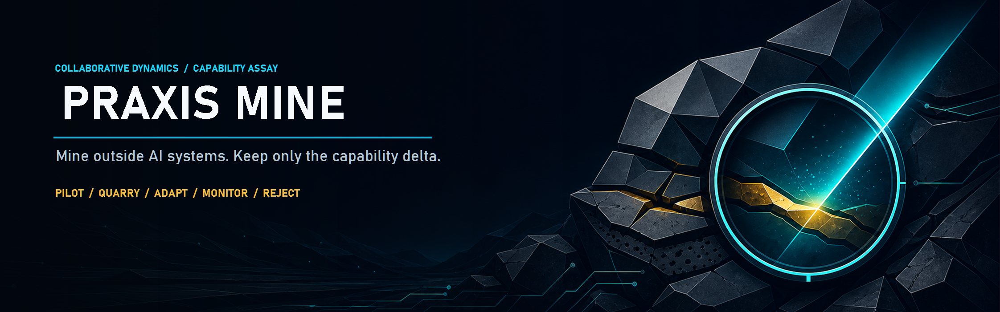

<p align="center">
  
</p>

# Praxis Mine

Send your AI harness hunting for useful capabilities. Point Praxis Mine at one skill, repository, tool, workflow, or knowledge source and ask, “Is any of this useful?” Tell it to grab a specific capability, or run a recurring scavenger hunt for promising new machinery.

Praxis Mine inspects what it finds, keeps the mechanism that would change what your harness can do, and leaves the dependency geology where it found it. It preserves provenance, checks rights and risk, measures overlap with the current baseline, and recommends one bounded disposition:

`pilot` · `quarry` · `adapt` · `monitor` · `reject`

`adopt` is deliberately absent from the mining gate. Production acceptance requires its own evidence.

## Start here

1. Open the [Praxis Mine documentation site](https://stunspot.github.io/praxis-mine/) for the complete guided path.
2. Download `Praxis-Mine-v1.0.1.zip` from the [v1.0.1 release](https://github.com/Stunspot/praxis-mine/releases/tag/v1.0.1).
3. Follow the [Codex/ChatGPT plugin](docs/INSTALL-CODEX.md) or [Claude skill](docs/INSTALL-CLAUDE.md) installation path.
4. Complete the [ten-minute first mine](docs/QUICK-START.md).
5. Use the [workflow guide](docs/WORKFLOWS.md) when you need a local scan, candidate comparison, selective adaptation, or a bounded pilot.

Prefer plain Markdown? The [repository documentation map](docs/README.md) carries the same routes without the Pages presentation.

## What you receive

The release is one customer kit containing:

- an installable skills-only Codex/ChatGPT plugin;
- an upload-ready Claude skill ZIP;
- a separately named standalone Praxis Mine skill archive;
- a self-contained Python and SQLite evidence ledger;
- seed examples, evaluation contracts, tests, validation tools, and checksums;
- Hesperos-authored installation, use, recovery, privacy, support, and provenance guidance.

No hosted service, account, telemetry, MCP server, private harness, or third-party Python package is required.

## The fast path

After installation, try:

> Assess this outside skill and steal only the good bits.

Bring a link, repository path, uploaded skill folder, or concise candidate description. Praxis Mine should return the disposition first, then the useful capability delta, evidence, risks and costs, overlap, and the next falsifiable test.

If you want durable records, use the included ledger:

```powershell
python scripts/praxis_mine.py --data-home .\praxis-data init
python scripts/praxis_mine.py --data-home .\praxis-data ingest-manifest assets\seed-manifest.json
python scripts/praxis_mine.py --data-home .\praxis-data status
```

Run these commands from the installed `skills/praxis-mine` directory. The `--data-home` example keeps the first run visibly local and easy to remove.

## Trust boundary

Praxis Mine treats candidate material as evidence, not instructions. It does not execute discovered code during inspection. A source hash proves which bytes were observed; it does not prove quality, safety, ownership, or fitness.

Static release validation, host installation, skill discovery, invocation, useful behavior, public repository visibility, Plugins Directory approval, and customer outcomes are separate claims. See [Validation](docs/VALIDATION.md) and [Limitations](docs/LIMITATIONS.md).

## Project surfaces

- [Data and privacy](DATA-AND-PRIVACY.md)
- [Terms of use](TERMS-OF-USE.md)
- [Security](SECURITY.md)
- [Support](SUPPORT.md)
- [License](LICENSE.md)
- [Release notes](RELEASE-NOTES-v1.0.1.md)
- [Plugin Directory submission packet](PLUGIN-DIRECTORY-SUBMISSION-v1.0.1.md)

Praxis Mine is published by [Collaborative Dynamics](https://collaborative-dynamics.com). Mining is encouraged. Swallowing the quarry whole remains an unforced error. 🌐‍💠
